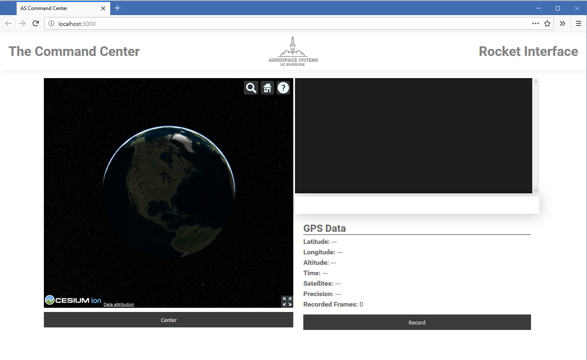

# Aerospace Systems GPS Tracking System

This is a prototype GPS tracking system that can wirelessly track a rocket's trajectory in real-time from a remote PC. Mind that this is still very much a work-in-progress, so you might experience hiccups occassionally. Nevertheless, this system has been tested at ground-zero at a range of 790 feet with no loss of information.

This repository contains all the software required to run the system, including: a browser-based app for viewing the position of the rocket, source code for the onboard Arduino, and a user setup guide. However, this repository does not disclose hardware schematics; you must contact University of California, Riverside's Aerospace Systems for this information.

## Features of the brower-based app

- 3D Earth view for visualizing rocket position
- Metrics panel for displaying latitude, longitude, altitude, and time
- Data recording capabilities to .CSV and .KDI files simultaneously

## Requirements

- Node.js must be installed

## Notes

The 3D Earth View uses Cesium, which is distributed under the Apache 2.0 license. Please refer to the LICENSE.md file for more details.
